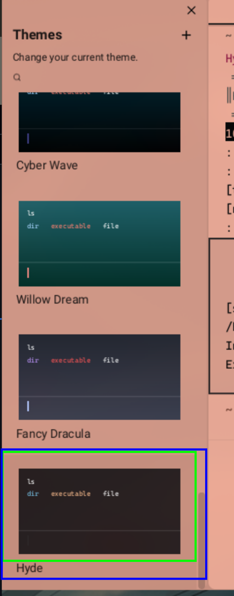

# Usage
## Adding Templates

To add templates, follow these steps:

1. Copy the file `/warp-terminal.dcol` to either `~/.config/hyde/wallbash/Wall-Ways` or `~/.config/hyde/wallbash/Wall-Dcol.
2. Run `Hyde reload` to generate the file.

#### Note 

In case it is not working, check if `${HOME}/.local/share/warp-terminal/themes/` exists. 

If not, run:
```
mkdir -p ${HOME}/.local/share/warp-terminal/themes/hyde
```

then rerun `Hyde reload`


## Applying the theme

1. Re-open `warp-terminal` then go to `Settings > Appearance > Current theme` and choose `HyDE`. 



## Reloading the theme

For now, warp-terminal does not have an option to dynamically change the current session's theme without intervention.

Option 1. Open the themepicker to trigger reload. In this case, we use "F5" to spawn the theme picker and effectively reload warp-terminal. (options 2 and 3 are dumb but still an option)

Option 2. Open `Settings` > `Appearance` Toggle `Sync with OS` or just open the theme picker. 

Option 3. Restart the whole warp terminal session.  


## TODO 

- [ ] Find a way to dynamically update the theme. 